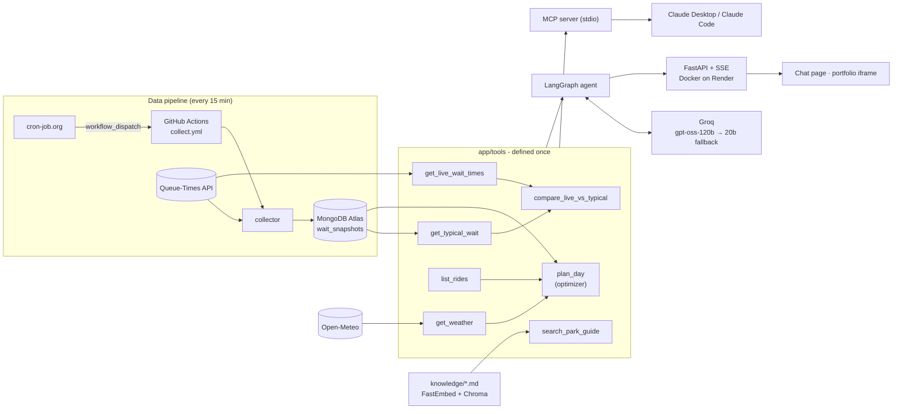
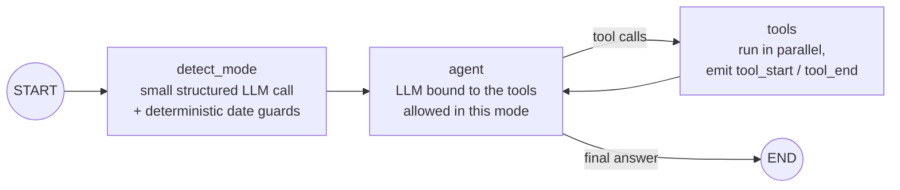

# Park Copilot

[](https://github.com/r3miphilippot/park-copilot/actions/workflows/ci.yml)
[](https://github.com/r3miphilippot/park-copilot/actions/workflows/collect.yml)

An AI agent that plans a visitor's day at Disneyland Paris (both parks). It combines **live wait
times**, a **wait-time history collected every 15 minutes**, the **hourly weather forecast** and a
**visit guide (RAG)** into a concrete, timed plan, and it never makes up a wait time.

**[Live demo](https://park-copilot.onrender.com)** (free hosting: the first load can take a minute)
· **[Portfolio](https://remiphilippot.vercel.app)** · FR / EN

Built to show, end to end: **LangGraph** agent, **tool calling**, **RAG**, **MCP** server,
**FastAPI** streaming, a scheduled **data pipeline**, **automated evals** with an LLM judge,
**observability** (structured logs, Prometheus metrics, **Grafana** dashboard), **Terraform**,
**Docker** and **CI/CD**, all on **free tiers only**.

## What it does

The agent detects which of two situations the visitor is in, from the question and the current
date in Paris:

| Mode | When | Data used |
|---|---|---|
| **Planning** | a future date ("we're coming on Saturday") | usual waits for that weekday, weather forecast, guide. **Never live waits.** |
| **In the park** | today, now ("what's quiet right now?") | live waits compared with the usual wait at this weekday and hour |

> *"J'aimerais venir demain à partir de 8h30 : le moins d'attente et le plus d'attractions à
> sensations ?"*
> → mode detection (tomorrow = a Wednesday) → `plan_day` optimizes the day from the usual wait
> of every ride at every hour, walking times and the weather → a timed plan from arrival to the
> night show: thrill rides first while queues are short, Single Rider lines if the visitor
> accepts riding apart, each wait tagged with the number of days of data behind it.

## Architecture



### The LangGraph graph

Built explicitly with `StateGraph`, so every step is readable and testable on its own:



- **Memory**: a checkpointer keyed by `thread_id` (least-recently-used conversations are evicted
  above 500).
- **Iteration limit**: after 6 LLM calls for one question, tools are unbound and the agent must
  answer with what it has.

### Design decisions

- **The LLM orchestrates, the code optimizes.** "Most rides, least waiting" is a scheduling
  problem, and early versions showed LLMs doing it badly (rides from other Disney parks, hops
  between parks every 30 minutes). `plan_day` is a deterministic planner: slot by slot it takes
  the ride with the best **value per minute spent** (value = what the visitor wants, e.g. a
  thrill ride for a thrill seeker; minutes = expected wait at that hour + walk + ride), favours
  rides that are cheap now but will get worse, keeps indoor rides for the rainy hours, uses
  Single Rider lines when allowed and leaves out rides not seen open recently (probably closed).
  The LLM only explains the plan.
- **A closed list of rides.** `list_rides` is the official catalogue (ids and names from
  Queue-Times, curated attributes: land, indoor, thrill level, Single Rider). The agent may only
  cite these rides, and an eval check fails if a plan names anything else.
- **The LLM proposes, the code decides.** `detect_mode` asks the LLM for a mode and a date, then
  plain Python enforces the rules: a future date is always *planning*. In planning mode the live
  tools are **not even offered** to the LLM, so "never use live waits for a future date" holds in
  code, not only in the prompt.
- **No date arithmetic by the LLM.** Models get weekdays wrong ("Saturday" became a Thursday in
  early tests). The prompt carries a 15-day calendar instead, so the date is looked up, not
  computed.
- **Tools never raise.** Each tool is a typed function returning a Pydantic model; a `tool_guard`
  decorator validates arguments and turns any failure (API down, database unreachable, bad
  argument) into a readable error such as *"External API unavailable. Do not guess values."*
- **Transparency is part of the data.** History tools return how many days of data back each
  estimate, plus a note when the history is empty or short; the agent must repeat it.
- **Free-tier aware.** Tool outputs are serialized compactly, and only the questions and final
  answers of previous turns are sent back to the LLM (old tool outputs are the biggest token
  cost).
- **Measured choices.** The embedding model was picked by benchmarking 4 models on real French
  questions (see [Free-tier design](#architecture--free-tier-design)).

## Architecture & free-tier design

Hard constraint: **100 % free**, and the project must survive the limits of every free tier.

| Service | Role | Free-tier limit | Strategy |
|---|---|---|---|
| **Groq** | LLM (`gpt-oss-120b`) | ~1,000 requests/day and 8,000 tokens/min **per model** | Automatic fallback to `gpt-oss-20b` on 429/timeout/5xx (separate quota); `retry-after` honoured (short waits retried, long ones put the primary in cooldown); per-IP rate limit (10/min) and global daily cap (200 chats) |
| **MongoDB Atlas M0** | Wait-time history | 512 MB storage | ~3,000 small documents/day: about a year of history; aggregations run server-side; indexes on `(ride_id, weekday, hour)` and `fetched_at` |
| **Render** | API hosting (Docker) | 512 MB RAM, 0.1 CPU, sleeps after 15 min idle | Lighter embedding model (~340 MB for the whole app, checked in CI with a 512 MB container); pinged every 10 min to stay awake |
| **GitHub Actions** | CI, collector, evals | Unlimited minutes on public repos; schedules are best effort | The collector is triggered by **cron-job.org** through the GitHub API (GitHub's own cron ran 2 times in 11 hours instead of 44); GitHub's schedule stays as a backup |
| **cron-job.org** | Punctual scheduler | Free | Triggers the collector every 15 min and pings the API every 10 min |
| **Queue-Times** | Live wait times | Free, attribution required | Cached 5 min (its own refresh rate) |
| **Open-Meteo** | Hourly weather | Free for non-commercial use, no key | Cached 1 h; forecasts up to 15 days ahead, a clear message beyond |
| **FastEmbed + Chroma** | RAG | Runs locally: no API, no quota | Index rebuilt at startup (45 sections, < 1 s): no persistent disk needed |
| **Langfuse** | LLM tracing (optional) | Free cloud plan | Enabled only when the keys are set; the app works without it |
| **Grafana Cloud** | Metrics dashboard | Free tier | Scrapes `/metrics/prometheus` (a few dozen series); the scrape also keeps Render awake |

**Why not Hugging Face Spaces?** It was the original target, but Docker/Gradio Spaces now require
a paid plan (only static Spaces stay free). Moving to Render's 512 MB meant measuring memory:
the multilingual embedding model alone used ~530 MB. Benchmarked on 14 French questions over the
guide, `all-MiniLM-L6-v2` found the right section in its top 3 for **14/14** questions (versus
12/14 for the multilingual model) while cutting the app from **766 MB to 341 MB**.

## Project structure

```
app/
  config.py         settings (pydantic-settings), park IDs, Paris timezone
  clock.py          single source of "now" (frozen in tests and evals)
  llm.py            LLM providers, fallback router, retry-after handling
  tools/            the 7 tools, defined once (agent + MCP), incl. ride catalogue and planner
  rag/              markdown chunking by section, FastEmbed + Chroma index
  agent/            LangGraph graph, prompts, terminal CLI
  api/              FastAPI app, rate limits, chat page (static/index.html)
  observability.py  JSON logs, metrics, Langfuse
collector/          Queue-Times → MongoDB snapshot collector
mcp_server/         MCP server exposing the same tools
knowledge/          the visit guide (original content, in French)
evals/              golden set, frozen tool outputs, runner + LLM judge
infra/terraform/    MongoDB Atlas (cluster, app user, network rule) as code
infra/grafana/      Grafana dashboard (importable JSON) and setup
tests/              150 tests, external HTTP calls mocked (respx)
.github/workflows/  ci.yml, collect.yml, evals.yml
```

## Getting started

Requirements: Python 3.11+ and [uv](https://docs.astral.sh/uv/).

```bash
uv sync
cp .env.example .env        # then fill in the values below
```

| Variable | Required | Purpose |
|---|---|---|
| `MONGODB_URI` | for history | MongoDB Atlas connection string |
| `GROQ_API_KEY` | for the agent | free key from [console.groq.com](https://console.groq.com) |
| `LLM_MODEL` / `FALLBACK_PROVIDER` / `FALLBACK_MODEL` | no | default `openai/gpt-oss-120b`, then `groq` / `openai/gpt-oss-20b`; locally `FALLBACK_PROVIDER=ollama` works too |
| `ALLOWED_ORIGINS` | no | comma-separated CORS origins |
| `RATE_LIMIT_PER_MINUTE` / `DAILY_REQUEST_CAP` | no | quota protection (default 10 and 200) |
| `EMBEDDING_MODEL` | no | FastEmbed model (default `sentence-transformers/all-MiniLM-L6-v2`) |
| `LANGFUSE_PUBLIC_KEY` / `LANGFUSE_SECRET_KEY` | no | enable Langfuse tracing |

```bash
uv run python -m collector.collect --dry-run          # fetch live waits, no database needed
uv run python -m app.agent.cli "Un plan pour samedi ?" # talk to the agent in a terminal
uv run uvicorn app.api.main:app --port 7860            # API + chat page on http://localhost:7860
uv run pytest                                          # tests (integration tests skip without credentials)
uv run ruff check .
```

With Docker:

```bash
docker build -t park-copilot .
docker run -p 7860:7860 --env-file .env park-copilot
```

## API

| Endpoint | Description |
|---|---|
| `POST /chat` | `{"message": "...", "thread_id": "optional", "lang": "fr" \| "en"}` → Server-Sent Events |
| `GET /health` | liveness, touches neither the LLM nor MongoDB |
| `GET /metrics` | requests, latency p50/p95, error rate, LLM fallback rate, tool calls, days of history |
| `GET /metrics/prometheus` | the same signals in Prometheus format, for Grafana (token-protected) |
| `GET /` | the chat page (`?lang=fr\|en`, `?embed=1` to embed it in another site) |

`/chat` streams distinct events, so a front end can show the tools running live:

| Event | Payload |
|---|---|
| `mode` | detected mode and target date |
| `tool_start` / `tool_end` | tool name, arguments, success, duration |
| `token` | a piece of the answer |
| `done` | thread id, tools used, providers, fallback, latency |
| `error` | a readable message |

A limit (rate limit, daily cap) is answered like a normal chat message, not as an HTTP error, so
the chat widget needs no special case.

```bash
curl -N -X POST http://localhost:7860/chat -H "Content-Type: application/json" \
  -d '{"message": "Il va pleuvoir demain ? Quelles attractions intérieures ?"}'
```

## Evaluation

`evals/` holds a **golden set of 19 cases**: planning, in-park, general questions and
hallucination baits (asking for an exact wait that does not exist in the data, or a minimum height
that is not in the guide). Each case sets:

- a **simulated date and time** (the whole app reads "now" from `app/clock.py`);
- **frozen tool outputs** (`evals/fixtures/*.json`, validated against the tools' Pydantic models),
  so only the LLM varies between runs; the guide search runs for real (local and deterministic);
- expectations: mode, target date, tools that must / must not be called, argument checks, and
  content checks.

| Category | What is checked |
|---|---|
| robustness | no crash |
| mode | detected mode and target date |
| tool_choice | expected tools called, forbidden tools never called, correct arguments |
| no_hallucination | every "N min" in the answer exists in a tool output; no invented services |
| transparency | the number of days of data is stated; missing or unavailable data is admitted |
| content | expected rides, rain taken into account, a full day (10+ timed steps, night show) |
| language | answers in the language picked in the interface |
| planning_quality | an **LLM judge** grades plans (timed, coherent, grounded, useful, complete) |

The judge is **another model** (`gpt-oss-20b`) than the agent (`gpt-oss-120b`), to avoid a model
grading itself. Cases hit by the free LLM quota are reported apart, not counted as agent failures.

**Baseline run**, before the planning improvements:

| Category | Pass rate |
|---|---|
| robustness | 100 % |
| mode | 100 % |
| tool_choice | 96 % |
| **no_hallucination** | **100 %** |
| transparency | 67 % |
| content | 75 % |
| language | 100 % |
| planning_quality | 50 % (average 2.94 / 5) |

The evals already paid off: they caught a **production bug** (the model called
`get_weather(date=...)` while the parameter was named `day`; Groq rejected the call and the agent
crashed), which led to renaming the parameter and retrying invalid tool calls once. A tester's
feedback ("only 3-4 rides, leaves at 6 pm, no night show") became new checks first, then prompt
and guide fixes.

```bash
uv run python -m evals.run_evals                               # all cases
uv run python -m evals.run_evals --cases plan_saturday_kids --no-judge
```

The **Evals** workflow runs on demand and on pull requests touching the agent, the tools, the RAG
or the evals; the report is published in the job summary.

## Observability

- **One JSON log line per request**: thread id, detected mode, tools called with their latency,
  LLM providers used, fallback, total latency, status.

  ```json
  {"event": "chat_request", "thread_id": "demo1", "mode": "planning", "target_date": "2026-09-29",
   "tools": [{"name": "get_weather", "duration_ms": 350, "ok": true},
             {"name": "search_park_guide", "duration_ms": 15, "ok": true}],
   "providers": ["groq:openai/gpt-oss-120b", "groq:openai/gpt-oss-20b"],
   "fallback": true, "status": "ok", "latency_ms": 2565}
  ```

- **`GET /metrics`**: request count, latency p50/p95, error rate, LLM fallback rate, rate-limited
  and capped requests, tool call counts, days of history, models in use.
- **Prometheus + Grafana**: counters and histograms (chats by outcome, answer latency, LLM
  fallbacks, tool calls and tool latency) at `/metrics/prometheus`, scraped by Grafana Cloud into
  a versioned dashboard: traffic, p50/p95, error rate, fallback rate, slowest tools, refused chats.
  See [`infra/grafana`](infra/grafana).
- **Langfuse** (optional): full traces of every LLM call and tool, grouped by conversation.
- **Warm-up**: the embedding model and the MongoDB connection are loaded at startup, in the
  background, so the first visitor does not pay for them (tools answer in ~15-20 ms once warm).

## MCP

The agent's 7 tools are also exposed as an [MCP](https://modelcontextprotocol.io) server
(stdio transport), built with the official `mcp` Python SDK (its high-level API, FastMCP, is
called `MCPServer` since v2). The functions are the same ones the LangGraph agent uses, imported
from `app.tools`: they are defined once.

| Tool | What it returns |
|---|---|
| `get_live_wait_times(park)` | current wait of every ride (Queue-Times, cached 5 min) |
| `get_typical_wait(ride?, weekday?, hour?, park?)` | average / median wait, observations and days of history |
| `compare_live_vs_typical(park)` | live wait vs usual wait at this weekday and hour (previous days only) |
| `get_weather(date)` | hourly forecast at the resort, rainy hours (Open-Meteo, cached 1 h) |
| `search_park_guide(query, k?)` | relevant passages of the visit guide (RAG) |
| `list_rides(park)` | the official ride catalogue: land, indoor, thrill level, Single Rider |
| `plan_day(park, date, start?, end?, preference?, single_rider?)` | an optimized, timed day plan (most rides, least waiting) |

Every tool is read-only. Failures (API down, date out of range, invalid argument) come back as
MCP error results (`isError: true`) with a readable reason, never as a crash.

The server reads its configuration (`MONGODB_URI`…) from the `.env` file at the repository root,
whatever directory it is started from. Without `MONGODB_URI`, the history tools return an error
and the other three still work.

### Claude Code

The repository ships a project-scoped [`.mcp.json`](.mcp.json): open the project in Claude Code
and approve the `park-copilot` server when prompted. To add it for all your projects instead:

```bash
claude mcp add --scope user park-copilot -- uv --directory /absolute/path/to/park-copilot run python -m mcp_server.server
```

Check it with `claude mcp list`, or `/mcp` inside a session.

### Claude Desktop

Open *Settings → Developer → Edit Config* and add the server to `claude_desktop_config.json`
(macOS: `~/Library/Application Support/Claude/`, Windows: `%APPDATA%\Claude\`):

```json
{
  "mcpServers": {
    "park-copilot": {
      "command": "uv",
      "args": [
        "--directory", "/absolute/path/to/park-copilot",
        "run", "python", "-m", "mcp_server.server"
      ]
    }
  }
}
```

On Windows, write the path with double backslashes (`"C:\\Users\\me\\park-copilot"`). If Claude
Desktop cannot find `uv`, use its full path as `command` (`which uv` / `where uv`). Restart Claude
Desktop, then ask for example: *"Il va pleuvoir samedi à Disneyland Paris ? Quelles attractions
intérieures faire ?"*

### Debugging

```bash
npx @modelcontextprotocol/inspector uv run python -m mcp_server.server
```

## CI/CD and deployment

| Workflow | Trigger | What it does |
|---|---|---|
| `ci.yml` | every push and PR | `ruff check`, `pytest`; `terraform fmt` + `validate`; then builds the Docker image and runs it with the free-tier constraints (port from `$PORT`, **512 MB memory limit**): fails if the app does not start or runs out of memory |
| `collect.yml` | cron-job.org every 15 min (+ GitHub schedule as backup) | collects wait times into MongoDB, then pings the API so it stays awake |
| `evals.yml` | manual, and PRs touching the agent, tools, RAG or evals | runs the golden set against the real LLM, report in the job summary |

Render builds the `Dockerfile` (non-root user, locked dependencies, embedding model downloaded at
build time) and redeploys on every push to `main`.

GitHub secrets: `MONGODB_URI` (collector), `API_URL` (keep-alive), `GROQ_API_KEY` (evals).
Render environment: `MONGODB_URI`, `GROQ_API_KEY`, `METRICS_TOKEN`.

The MongoDB Atlas resources (M0 cluster, least-privilege app user, network rule) are described
with **Terraform** in [`infra/terraform`](infra/terraform), with safety nets: `prevent_destroy`
on the cluster and no password rotation on the app user.

## Known limitations

- **Short history.** The collector started in September 2026: usual waits become reliable as
  weeks of data accumulate. The agent says how many days each estimate relies on, and falls back
  on the guide when there is no data.
- **Unofficial data.** Wait times come from Queue-Times.com, not from the parks. Opening hours,
  parade and show times are not in any data source: the agent tells visitors to check them in the
  official app.
- **Behaviour rules live partly in the prompt**, so they are not guaranteed: that is why the
  critical ones are also enforced in code (tool filtering per mode) and measured by the evals.
- **Free tiers.** 8,000 tokens per minute on Groq limits concurrent chats (the fallback model
  absorbs peaks); Render sleeps when idle and cold-starts in about a minute; conversations are
  kept in memory, in a single process, and lost on restart.
- **Evals are small** (19 cases) and LLM output varies between runs: several runs are needed for
  a solid comparison.
- The GitHub API version used by the external trigger is scheduled for sunset in March 2028.

---

Powered by [Queue-Times.com](https://queue-times.com/) · Weather data by
[Open-Meteo.com](https://open-meteo.com/) (CC BY 4.0).
Independent project, not affiliated with or endorsed by Disneyland Paris; ride and park names are
used only to describe the data.
